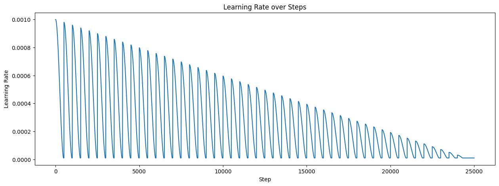

An attempt at a custom scheduler.

The learning rate will go (hopefully), from base to min lr in every epoch, then at the end of an epoch it will decay, next epoch it will start from the decayed lr and go down to min lr over the course of the epoch.

